            

**StreamWatch** is a real-time synchronized media watching platform. It allows users to create rooms, synchronize video playback, and watch content together in real time using **SignalR**.

The platform supports third-party media synchronization (such as **YouTube**) as well as
temporary user-uploaded media via **S3 providers**.

---
## Table of Contents
- [Features](#features)
- [Architecture Diagram](#architecture-diagram)
- [Tech Stack](#tech-stack)
- [Production Deployment Guide](#production-deployment-guide)
- [Screenshots](#screenshots)
---
##  Features

- Real-time room-based media synchronization across multiple users
- YouTube video synchronization using shared playback state and timestamps
- **User-uploaded media support** via S3-compatible storage
- Thumbnail generation using **FFmpeg** (video) and **libvips** (images/gifs)
- Public and private rooms with real-time chat
- **Rich chat features:**
  - Text messaging
  - Image sharing
  - Private messages (whispers)
- **Country flag resolution** based on user IP using the **MaxMind GeoIP database**
- Role-based authentication and authorization using JWT
- Secure session handling with refresh tokens stored in HTTP-only cookies
- User profiles with customizable profile pictures
- **Friend system** with:
  - Friend requests
  - Room invitations
  - Real-time notifications
- User and room reporting system
- Moderation tools for abuse prevention

---
##  Architecture Diagram

---
## Tech Stack
### Frontend
- React
- Vite
- Tailwind CSS
### Backend
- .NET / ASP.NET Core
- ASP.NET Identity
- SignalR (WebSockets)
- Hangfire (background jobs)
### Database
- PostgreSQL
- Entity Framework Core
- pgAdmin
### Caching & Realtime
- Redis Stack
- Redis OM
- Redis Insight
### Storage
- S3-compatible object storage (S3, Cloudflare R2)
### Observability
- Serilog
- Seq
### Infrastructure
- Docker / Docker Compose
- Nginx (reverse proxy)

---
# Production Deployment Guide

## Prerequisites

Before deploying the application, make sure you have the following tools installed on your server.
### Docker & Docker Compose

Docker is required to run all services (API, database, nginx, etc.) in containers.
- Install Docker:  
    [https://docs.docker.com/engine/install/](https://docs.docker.com/engine/install/)

---
### Node.js & NVM

The frontend build uses **Vite**, which requires Node.js.  
- Install NVM:  
    https://github.com/nvm-sh/nvm#installing-and-updating
    
After installing NVM, install Node.js:

`nvm install --lts nvm use --lts`

---
## Production Setup Steps

### 1. Clone the repository

`git clone https://github.com/lucas3546/StreamWatch.git`

---
### 2. Build the frontend

Navigate into the project and install frontend dependencies:

`cd StreamWatch`
`cd src/frontend npm install`

Build the frontend for production:

`npx vite build`

This will generate the production-ready frontend files

Go back to the project root:

`cd ../../`

---
### 3. Configure environment variables

Edit the `.env` file in the project root with your credentials:

`nano .env`

Save and close the file.

---
### 4. Configure Nginx domains

Edit the Nginx configuration file:

`nano default.conf`

Replace the following placeholders:

`server_name example.com www.example.com;`

With your real domain, example:

`server_name streamwatch.cc www.streamwatch.cc;`

---
### 5. Add SSL certificates

Place your SSL certificate files in the **project root directory**:

`cert.pem key.pem`

These files are required for HTTPS and are referenced by `default.conf`.

---
### 6. Start PostgreSQL and run database migrations

Start only the PostgreSQL service:

`docker compose up postgres`

Apply the schema migration:

`docker exec -i streamwatch-postgres-1 \   psql -U postgres -d pgdb \   < src/backend/StreamWatch.Infraestructure/migration.sql`

---
### 7. Start all services

Finally, start the full application stack:

`docker compose up -d`

---
### Default accounts

After the first startup, the application automatically creates the following default accounts:

| Role       | Email                   | Password          |
|------------|-------------------------|-------------------|
| Admin      | admin@streamwatch.cc    | Administrator1!  |
| Moderator | mod@streamwatch.cc      | Moderator1!      |

These credentials are intended for initial setup, change the passwords after the first login.

---
# Screenshots

Here are some screenshots of the site, including the moderation views.
### Main Page, rooms ordered by creation time
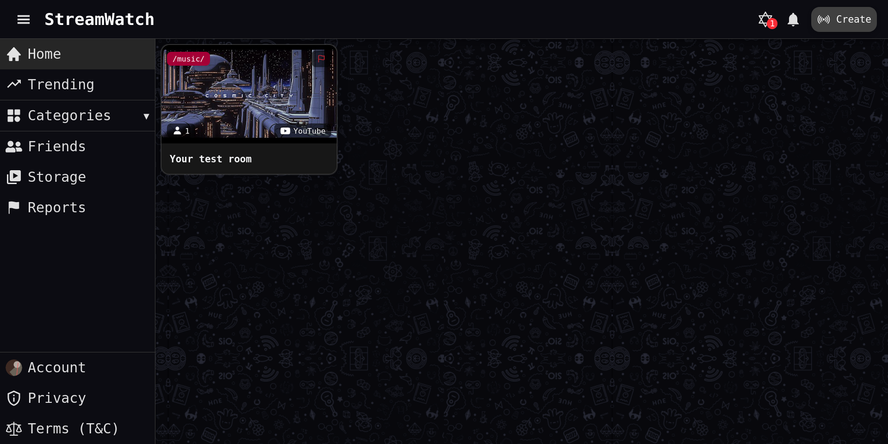

### Room view for the leader (Admin role)
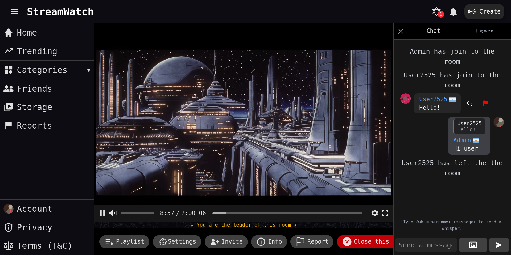

### Room view for a user (User role)
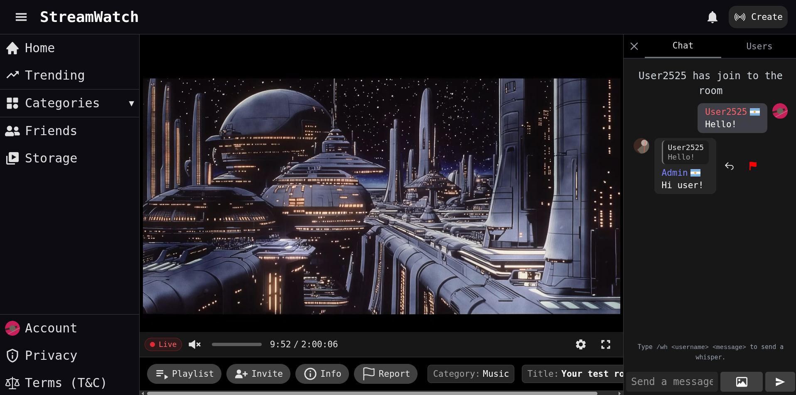

### Room playlist, add content from YouTube or local media
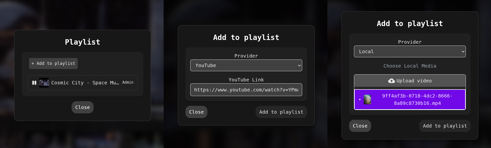

### Invite friends to a room
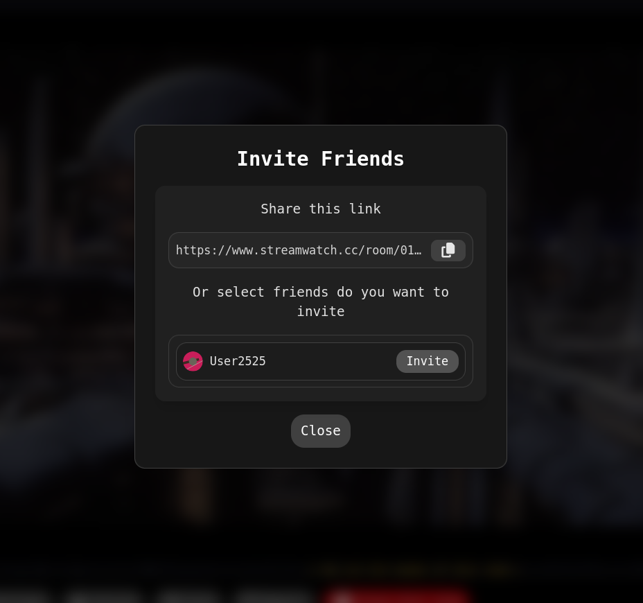

### User storage
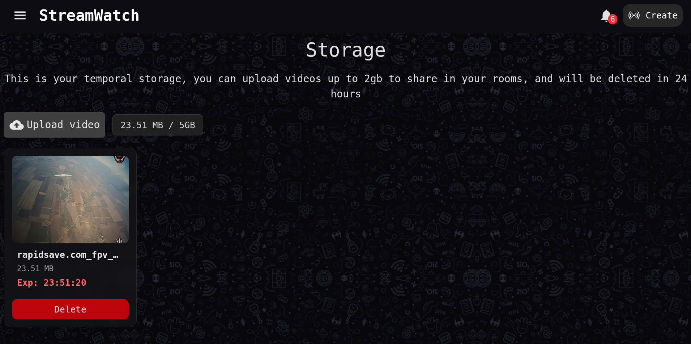

### Friend list
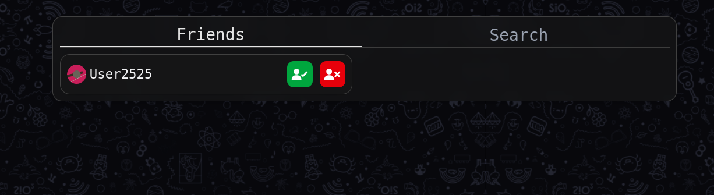

### Friend request
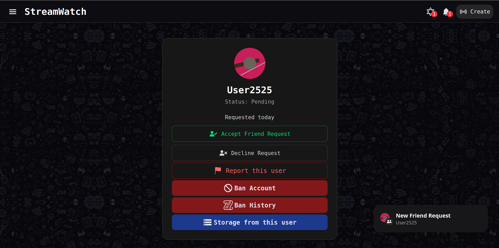

### Report user and report room
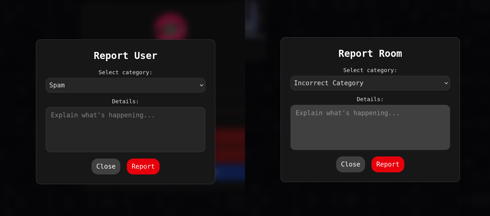

### Report details view
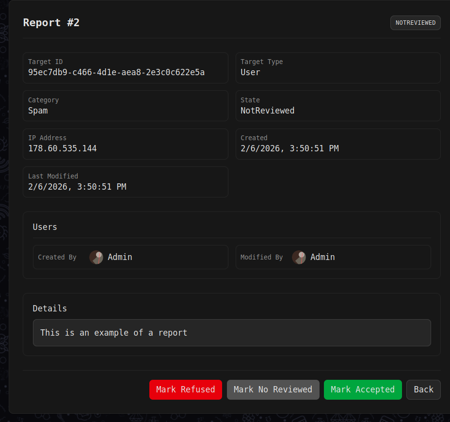

### Ban user (by account and IP address)
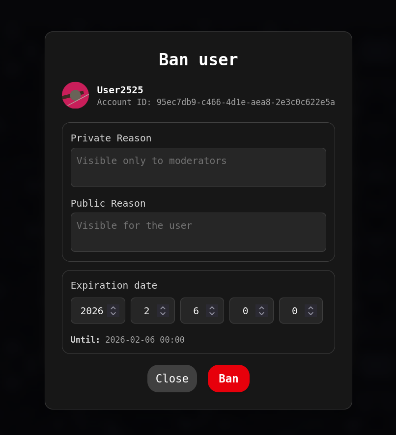
